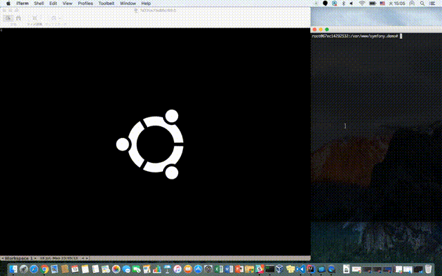

# Docker Codeception Example
This is an example of [Codeception](http://codeception.com/) on docker containers.

[](https://circleci.com/gh/imunew/docker-codeception-example)

## Install
### Docker for Mac
Download installer and install.<br>
https://docs.docker.com/docker-for-mac/install/

## Setup
### Starting Docker compose
```
$ docker-compose up -d --build
```

### Run php container and composer install

```
$ docker-compose exec php composer install
```

### Run acceptance tests
```bash
$ docker-compose exec php bin/codecept run acceptance
Codeception PHP Testing Framework v2.2.2
Powered by PHPUnit 5.4.6 by Sebastian Bergmann and contributors.

Acceptance Tests (2) -------------------------------------------------------------------------------------------------------------------------------------------------------------------------------------------------
Testing acceptance
✔ BlogCept: Open blog page and see article there (4.411s)
✔ LoginCept: Login as admin to backend (6.607s)
----------------------------------------------------------------------------------------------------------------------------------------------------------------------------------------------------------------------


Time: 12.89 seconds, Memory: 10.00MB

OK (2 tests, 5 assertions)
```

### Run acceptance tests with VNC client
- For Mac
  - Starting `Finder`.
  - Use `Connect to Server`.
  - Input `vnc://localhost:5900` to `Server Address`.
  - Input `secret` to `Password`.

- Run acceptance tests
  - Execute `bin/codecept run` command in php container.



